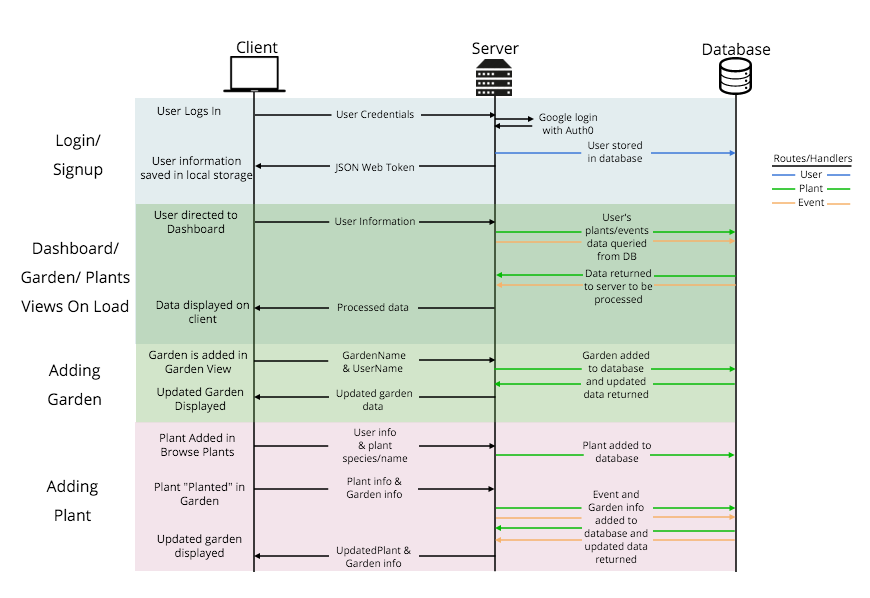

# Greenius

Greenius is a full-stack web application which helps individuals to plant and manage luscious and healthy gardens. It allows gardeners of all levels to grow their own flowers, fruits, and vegetables with ease. Greenius assists gardeners in learning more information about where to plant, when to water and how to grow healthier fruits and vegetables. Greenius was developed over the course of three weeks. This application delivers the following features:

1. Signup/Login through Google, implemented with Auth0 to provide assistance with client-side and server-side (API) authentication.
2. Browse from over 100 commonly chosen plant species and view critical information for growing healthy plants. Species data scraped from (http://www.almanac.com/).
3. Add plants to the 'BrowsePlant' sandbox by entering a plant nickname and clicking 'Add Plant'.
4. View all your plants from the 'My Plants' page and find additional species information by clicking on a specific plant.
5. Create separate gardens with our simple garden builder, utilizing angular-drag-and-drop library.
6. Plant and set watering schedule by drag and dropping a plant from the nursery sandbox into one of the garden sandboxes.
7. Watering events scheduling is automatically generated by using the moments.js library.
8. View watering 'Events' calendar from the 'Dashboard' page, allowing for weekly and/or monthly watering schedules. Events calendar was implemented with AngularUI calendar library.
9. Email notifications reminding garden enthusiasts of upcoming watering events, utilizing Nodemailer, an e-mail sending module for Node.js.
10. An SQL database architected through SQLite.
11. A testing suite with over 50 tests for various functionality, utilizing Karma for front-end unit-testing and jasmine for backend unit-testing.

All of these features makes it incredibly easy to research, organize, and manage gardens. Take a look at the code base and become a contributor!

##Architecture

##File Structure

##Installation

1. Fork the Greenius repository from (https://github.com/GitMoneyCrew/greenius)
2. Run ($ npm install )
3. Create config file in server/env directory by copying 'config.example.js', naming 'config.js', and (email greenius.thesis@gmail.com for config variables)
4. ...continue to 'usage'

##Usage

1. Navigate to the greenius directory and execute `gulp' from the command line

Thats it! You can view greenius from your (http://localhost:3000/)

##Testing

1. For front-end testing, execute in your terminal `gulp tdd'.
2. For back-end testing, execute in your terminal `jasmine'.

##Contributing

1. Fork it!
2. Create your feature branch: `git checkout -b my-new-feature`
3. Commit your changes: `git commit -m 'Add some feature'`
4. Be sure to checkout the CONTRIBUTING.md style guide for proper styling and commit message format.
5. Push to the branch: `git push origin my-new-feature`
6. Submit a pull request

##Authors
1. Robert Cardiff, Product owner
2. Elizabeth Banalagay, Scrum master
3. Geetha Ratnam
4. Brandon Goodfliesh

##License

MIT
